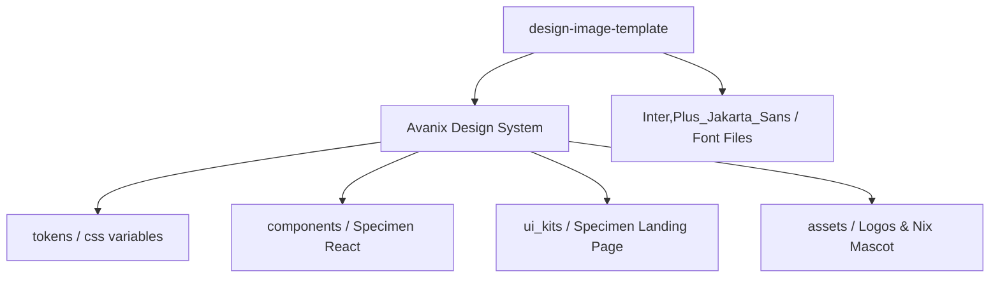

# 🌌 Avanix — Design & Brand Assets

> **"AI thực chiến — ra kết quả thật"**
> 
> *Avanix là cộng đồng và nền tảng khóa học AI thực chiến hàng đầu, nơi chia sẻ các mẫu thiết kế hệ thống, quy trình tự động hóa (n8n, Claude, Antigravity...) giúp tối ưu hóa công việc thực tế.*

---

## 🎨 Ngôn Ngữ Thiết Kế: Liquid Glass 3D

Thương hiệu Avanix mang phong cách thiết kế **Liquid Glass 3D** với các đặc trưng:
- 🧊 **Thẻ kính mờ frosted glass**: Sử dụng `backdrop-blur(18px)` kết hợp viền mờ màu trắng tinh tế.
- ⚡ **Ánh sáng xanh Neon**: Điểm nhấn chủ đạo với mã màu Electric Blue `#0A5BFF`.
- 🐧 **Mascot Nix**: Chú chim cánh cụt Nix dễ thương với các tư duy thực chiến.
- 🌌 **Thế giới Navy**: Sử dụng gradient xanh Navy sâu thẳm làm nền chủ đạo (`#16236e → #0B1240 → #06091F`).

---

## 📂 Sơ Đồ Cấu Trúc Dự Án

Dự án này lưu trữ toàn bộ hệ thống tài nguyên thiết kế (Design System) của Avanix:



### 🔗 Danh sách tài nguyên chính:

| Thư mục / Tệp tin | Vai trò / Chi tiết |
| :--- | :--- |
| [📁 Avanix Design System](file:///Users/trickstar/Documents/avanix/design-image-template/Avanix%20Design%20System) | Thư mục cốt lõi chứa toàn bộ Design System của dự án. |
| [📄 readme.md](file:///Users/trickstar/Documents/avanix/design-image-template/Avanix%20Design%20System/readme.md) | Hướng dẫn chi tiết về các nguyên lý viết nội dung, cấu trúc visual & index. |
| [🎨 styles.css](file:///Users/trickstar/Documents/avanix/design-image-template/Avanix%20Design%20System/styles.css) | File CSS tổng hợp tất cả các tokens (Colors, Typography, Spacing, Primitives). |
| [🌐 ui_kits/avanix-web/index.html](file:///Users/trickstar/Documents/avanix/design-image-template/Avanix%20Design%20System/ui_kits/avanix-web/index.html) | Bản nguyên mẫu (prototype) giao diện Landing Page, Courses & Community. |
| [📂 assets/logo/](file:///Users/trickstar/Documents/avanix/design-image-template/Avanix%20Design%20System/assets/logo) | Logo dạng monogram A, lockup, avatar chính thức của Avanix. |
| [📂 assets/mascot/](file:///Users/trickstar/Documents/avanix/design-image-template/Avanix%20Design%20System/assets/mascot) | Bản vẽ 3D các biểu cảm và tư thế của chú chim cánh cụt Nix. |
| [📂 Inter,Plus_Jakarta_Sans/](file:///Users/trickstar/Documents/avanix/design-image-template/Inter,Plus_Jakarta_Sans) | Bộ font chữ chính thức phục vụ thiết kế nội bộ và giao diện web. |

---

## 🛠️ Hướng Dẫn Sử Dụng Nhanh

### 1. Tích hợp Hệ thống Token & CSS
Nhúng tệp CSS tổng hợp vào ứng dụng của bạn:
```html
<link rel="stylesheet" href="Avanix Design System/styles.css">
```

### 2. Sử dụng Giao diện Frosted Glass (.av-glass)
Sử dụng các lớp CSS Primitives có sẵn để tạo các khối giao diện mờ:
```html
<div class="av-glass">
  <span class="av-eyebrow">AI AUTOMATION</span>
  <h2>Quy trình Tự động hóa n8n</h2>
  <p>Học cách thiết kế hệ thống Agent tự vận hành và kết nối các công cụ thông qua n8n.</p>
</div>
```

---

> [!IMPORTANT]
> **Quy định thiết kế & Biên soạn nội dung:**
> - Luôn ưu tiên dùng **Tiếng Việt** cho nội dung và **Tiếng Anh** cho các taglines/eyebrows ngắn.
> - Tuyệt đối không tự ý thêm các tone màu khác ngoài bảng màu chính: Navy (`#0B1240`) & Electric Blue (`#0A5BFF`).
> - Ưu tiên sử dụng bộ icon **[Lucide](https://lucide.dev)** (stroke 2px) để đồng bộ hoàn toàn với ngôn ngữ thiết kế của hệ thống.
